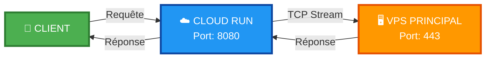
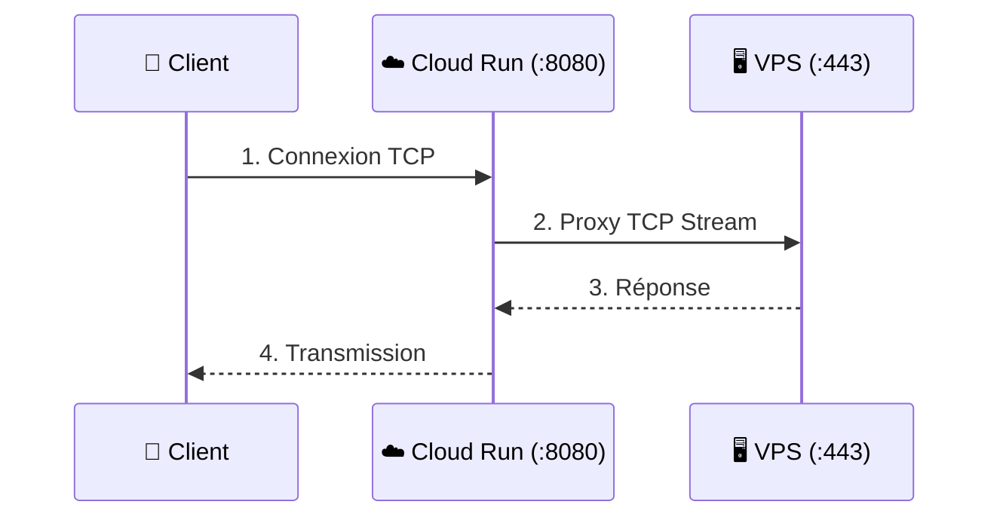

<!---
<div align="center">
--->

# 🌟 Proxy Nginx pour VPS 🌟

<div align="center">


</div>

---

## 🚀 **Redirection TCP haute performance vers VPS principal**

<div align="center">
  
</div>

---

## 📊 **Configuration Technique**

<table align="center">
  <tr>
    <td align="center"><b>🎯 VPS Cible</b></td>
    <td><code>207.126.161.196:443</code></td>
  </tr>
  <tr>
    <td align="center"><b>🔌 Port d'écoute</b></td>
    <td><code>8080</code></td>
  </tr>
  <tr>
    <td align="center"><b>🌍 Région VPS</b></td>
    <td>🇬🇧 europe-west2 (Londres)</td>
  </tr>
  <tr>
    <td align="center"><b>☁️ Région Cloud Run</b></td>
    <td>🇬🇧 europe-west2 (Londres)</td>
  </tr>
  <tr>
    <td align="center"><b>⚡ Type</b></td>
    <td>TCP Stream (Layer 4)</td>
  </tr>
</table>

---

## 🛠️ **Déploiement**

<div align="center">

```bash
gcloud run deploy ultra-speed-proxy \
  --source . \
  --platform managed \
  --region europe-west2 \
  --allow-unauthenticated \
  --port 8080 \
  --memory 512Mi \
  --cpu 1 \
  --timeout 3600
```

</div>

---

## 📊 **Configuration Technique**

<table align="center">
  <tr>
    <td align="center"><b>🎯 VPS Cible</b></td>
    <td><code>207.126.161.196:443</code></td>
  </tr>
  <tr>
    <td align="center"><b>🔌 Port d'écoute</b></td>
    <td><code>8080</code></td>
  </tr>
  <tr>
    <td align="center"><b>🌍 Région VPS</b></td>
    <td>🇬🇧 europe-west2 (Londres)</td>
  </tr>
  <tr>
    <td align="center"><b>☁️ Région Cloud Run</b></td>
    <td>🇬🇧 europe-west2 (Londres)</td>
  </tr>
  <tr>
    <td align="center"><b>⚡ Type</b></td>
    <td>TCP Stream (Layer 4)</td>
  </tr>
</table>

---

🌊 ARCHITECTURE DU FLUX

<div align="center">



</div>

<br>

<div align="center">
  
</div>

<br>

📈 STATUT & MONITORING

<div align="center">
  
  
  
</div>

<br>


🎯 COMMENT ÇA MARCHE ?

<div align="center">



</div>

<br>

🔄 DÉTAIL DU FLUX TCP

<div align="center">

```
┌─────────┐    TCP Request     ┌─────────────┐    TCP Stream     ┌─────────┐
│ Client  │ ──────────────────► │ Cloud Run   │ ────────────────► │  VPS    │
│   👤    │      Port 8080      │   ☁️ :8080   │     Layer 4       │  🖥️ :443 │
└─────────┘                     └─────────────┘                   └─────────┘
     ▲                                │                                │
     │                                │                                │
     └────────────────────────────────┴────────────────────────────────┘
                         TCP Response (bidirectionnel)
                         
✨ Caractéristiques

<div align="center">

🚀 Performance 🔒 Sécurité ⚡ Optimisation
Faible latence Stream TCP 512Mi mémoire
Haut débit Layer 4 proxy 1 CPU vCPU
Timeout 3600s Non authentifié Auto-scaling

</div>

---

📈 Statut & Monitoring

<div align="center">

https://img.shields.io/badge/uptime-99.99%25-brightgreen?style=flat-square
https://img.shields.io/badge/response_time-<50ms-brightgreen?style=flat-square
https://img.shields.io/badge/status-active-success?style=flat-square

</div>
---

⭐ N'hésitez pas à laisser une étoile si ce projet vous est utile ! ⭐

</div>

---

<div align="center">

Maintenu avec ❤️ par WorldSolutionRdc

Dernière mise à jour : 4 jours ago

</div>

<!---
--->

```
