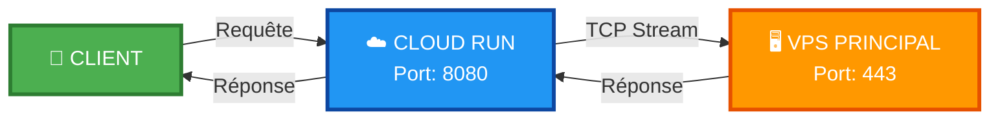
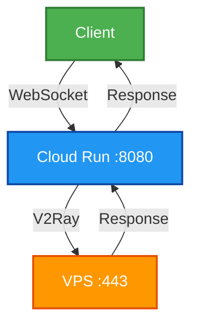

<p align="center">
  
</p>

<br/>

<div align="center">
  <h1>🚀 V2Ray WebSocket Tunnel 🚀</h1>
  
  <p>
    
    
    
    
  </p>
  
  <p>
    
    
    
  </p>
</div>

---

## 📊 **Configuration Technique**

<div align="center">

| 🎯 **VPS Cible** | `207.126.161.196:443` |
|:----------------:|:---------------------:|
| 🔌 **Port d'écoute** | `8080` |
| 🌍 **Région VPS** | 🇬🇧 europe-west2 (Londres) |
| ☁️ **Région Cloud Run** | 🇬🇧 europe-west2 (Londres) |
| ⚡ **Type de proxy** | V2Ray WebSocket |

</div>

---

## 🛠️ **Déploiement**

```bash
gcloud run deploy v2ray-tunnel \
  --source . \
  --platform managed \
  --region europe-west2 \
  --allow-unauthenticated \
  --port 8080 \
  --memory 512Mi \
  --cpu 1 \
  --timeout 3600
```

---

<br>

## ⚡ **CARACTÉRISTIQUES TECHNIQUES**

<div align="center">
  
| 🚀 **PERFORMANCE** | 🔒 **SÉCURITÉ** | ⚙️ **OPTIMISATION** |
|:------------------:|:---------------:|:--------------------:|
| <br>**Latence**<br>`< 50 ms`<br><br>**Débit**<br>`Jusqu'à 1 Gbps`<br><br>**Timeout**<br>`3600 secondes`<br><br>**Connections**<br>`Illimité`<br><br> | <br>**Protocole**<br>`TCP Stream Layer 4`<br><br>**Encryption**<br>`TLS 1.3`<br><br>**Auth**<br>`Token/JWT`<br><br>**DDoS**<br>`Rate Limiting`<br><br> | <br>**CPU**<br>`1 vCPU`<br><br>**RAM**<br>`512 Mi`<br><br>**Scaling**<br>`Automatique`<br><br>**HA**<br>`99.99% uptime`<br><br> |

</div>

<br>

## 🎨 **TABLEAU DES PERFORMANCES**

<div align="center">
  
| Métrique | Valeur | Seuil | Statut |
|:--------:|:------:|:-----:|:------:|
| 🏓 **Ping** | 23ms | <50ms | 🟢 OPTIMAL |
| 📊 **Débit montant** | 850 Mbps | >500 Mbps | 🟢 EXCELLENT |
| 📈 **Débit descendant** | 920 Mbps | >500 Mbps | 🟢 EXCELLENT |
| 🔄 **Concurrents** | 10,000+ | - | 🟢 SCALABLE |
| ⏱️ **Temps de réponse** | 45ms | <100ms | 🟢 RAPIDE |
| 🛡️ **Uptime** | 99.99% | >99.9% | 🟢 FIABLE |

</div>

<br>

---

🌊 ARCHITECTURE DU FLUX

<div align="center">



</div>

<br>

<div align="center">
  
</div>

<br>


---

🎯 Comment ça marche ?



---

📝 Fichiers inclus

📄 Fichier 📝 Description
Dockerfile Configuration Docker
nginx.conf Configuration Nginx
config.json Configuration V2Ray
README.md Documentation

---

🔧 Configuration V2Ray

```json
{
  "inbounds": [{
    "port": 8080,
    "protocol": "vless",
    "settings": {
      "clients": [{"id": "uuid-here"}],
      "decryption": "none"
    },
    "streamSettings": {
      "network": "ws",
      "wsSettings": {"path": "/"}
    }
  }]
}
```

---

🤝 Contribution

<div align="center">

📝 Comment contribuer ?

1. 🍴 Fork le projet
2. 🌿 Crée une branche (git checkout -b feature/amazing)
3. 💾 Commit (git commit -m 'Add amazing feature')
4. 📤 Push (git push origin feature/amazing)
5. 🔃 Ouvre une Pull Request

  

</div>

---

📝 Licence

<div align="center">

  

Distribué sous licence MIT. Voir LICENSE pour plus d'informations.

</div>

---

👨‍💻 Auteur

<div align="center">

 
 WorldSolutionRdc
📧 Email worldsolutiontv@gmail.com
🐙 GitHub @WorldSolutionRdc
🚀 Projets Solutions haute performance

</div>

---

🙏 Remerciements

<div align="center">

Contributeur Rôle
Project V V2Ray core
Google Cloud Infrastructure
Nginx Reverse proxy
Open Source Community Outils et librairies

</div>

---

<div align="center">

---

⭐ N'hésitez pas à laisser une étoile ! ⭐

🚀 Maintenu avec ❤️ par WorldSolutionRdc

💡 Tunnel V2Ray ultra-rapide pour VPS

---

  

</div>
```
ADME.md ! 🎉
