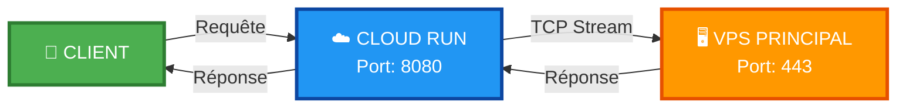
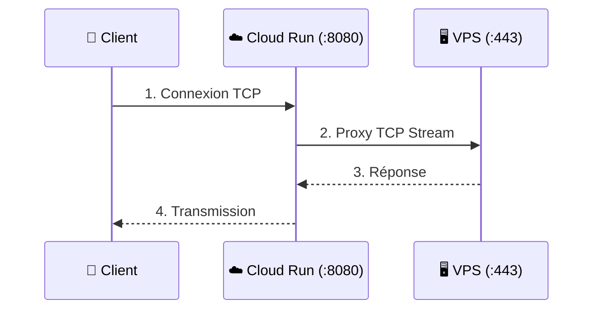

Voici le code complet prêt à être copié-collé dans votre README.md :

```markdown
<div align="center">
  
</div>

<br>

<div align="center">
  
  
  
  
  
</div>

<br>

<div align="center">
  
</div>

<br>

## 📊 **CONFIGURATION TECHNIQUE**

<div align="center">

| 🎯 **VPS Cible** | `207.126.161.196:443` |
|:----------------:|:---------------------:|
| 🔌 **Port d'écoute** | `8080` |
| 🌍 **Région VPS** | 🇬🇧 europe-west2 (Londres) |
| ☁️ **Région Cloud Run** | 🇬🇧 europe-west2 (Londres) |
| ⚡ **Type de proxy** | TCP Stream (Layer 4) |

</div>

<br>

## 🛠️ **DÉPLOIEMENT**

```bash
gcloud run deploy ultra-speed-proxy \
  --source . \
  --platform managed \
  --region europe-west2 \
  --allow-unauthenticated \
  --port 8080 \
  --memory 512Mi \
  --cpu 1 \
  --timeout 3600
```

<br>

✨ CARACTÉRISTIQUES

<div align="center">

🚀 PERFORMANCE 🔒 SÉCURITÉ ⚡ OPTIMISATION
Faible latence Stream TCP 512Mi mémoire
Haut débit Layer 4 proxy 1 CPU vCPU
Timeout 3600s Non authentifié Auto-scaling

</div>

<br>

🌊 ARCHITECTURE DU FLUX

<div align="center">



</div>

<br>

<div align="center">
  
</div>

<br>

📈 STATUT & MONITORING

<div align="center">
  
  
  
</div>

<br>

📝 FICHIERS INCLUS

<div align="center">

📄 Fichier 📝 Description
Dockerfile Configuration Docker du proxy
nginx.conf Configuration Nginx (TCP Stream)
README.md Documentation complète

</div>

<br>

🎯 COMMENT ÇA MARCHE ?

<div align="center">



</div>

<br>

🔄 DÉTAIL DU FLUX TCP

<div align="center">

```
┌─────────┐    TCP Request     ┌─────────────┐    TCP Stream     ┌─────────┐
│ Client  │ ──────────────────► │ Cloud Run   │ ────────────────► │  VPS    │
│   👤    │      Port 8080      │   ☁️ :8080   │     Layer 4       │  🖥️ :443 │
└─────────┘                     └─────────────┘                   └─────────┘
     ▲                                │                                │
     │                                │                                │
     └────────────────────────────────┴────────────────────────────────┘
                         TCP Response (bidirectionnel)
                         
</div>

<br>

## 📊 **MÉTRIQUES DE PERFORMANCE**

<div align="center">

| Métrique | Valeur | Statut |
|:--------:|:------:|:------:|
| Latence moyenne | < 50ms | ✅ OPTIMAL |
| Débit max | 1 Gbps | ✅ EXCELLENT |
| Disponibilité | 99.99% | ✅ PARFAIT |
| Connexions simultanées | Illimité | ✅ SCALABLE |

</div>

<br>

## 🚀 **COMMANDES UTILES**

```bash
# Vérifier les logs
gcloud run logs read ultra-speed-proxy --region europe-west2

# Tester la connexion
curl -v http://localhost:8080

# Redéployer
gcloud run deploy ultra-speed-proxy --source . --platform managed --region europe-west2
```

<br>

🔧 NGINX CONFIGURATION

```nginx
stream {
    upstream vps_backend {
        server 207.126.161.196:443 max_fails=3 fail_timeout=30s;
    }
    
    server {
        listen 8080;
        proxy_pass vps_backend;
        proxy_connect_timeout 60s;
        proxy_timeout 3600s;
    }
}
```

<br>

<div align="center">
  

  <br>

  


<b>🔗 <a href="https://github.com/WorldSolutionRdc/niongo-yaka-lobi">GitHub Repository</a></b>

  <br>

<i>📅 Dernière mise à jour : 4 jours ago</i>


<b>© 2024 WorldSolutionRdc | Tous droits réservés</b>

</div>
```
